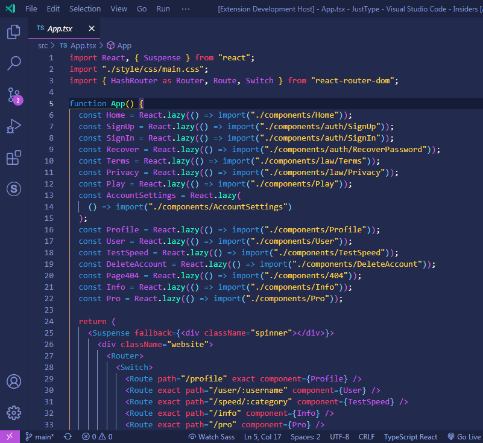

<h1>Scorpion Theme for Visual Studio Code</h1>
<b>A professional looking good theme for VS Code that will make your eyes relaxed for coding, it has as the main color a shade of purple-pink, and 3 other different colors that will go perfect with the purple.</b>

<h2>Preview</h2>

<h2>Install</h2>

You can install the theme by going into the "Extensions" menu in the Visual Studio Code or by going to the Microsoft Marketplace and install it from there, do not forget to leave a review, thanks :)

Link to marketplace: 

<h2>Contribute</h2>

If you want to contribute to this theme please follow the below steps.

<ol>
    <li>Fork and clone the repository using: `git clone https://github.com/tudorale/scorpion-theme`</li>
    <li>Make a special branch for your changes. `git checkout -b changes`</li>
    <li>Open the scorpion-theme folder from your machine VS Code.</li>
    <li>Make any changes you want or you may think are improving the theme.</li>
    <li>Preview your changes using the Debugging tool from VS Code by pressing F5.</li>
    <li>If you are happy with what you made please commit and push your changes to your repository.</li>
    <li>Make a Pull Request to this repository and we will see if your features are good for us.</li>
</ol>

<h2>License</h2>

The theme is running under the <a href="./LICENSE">MIT License</a>

